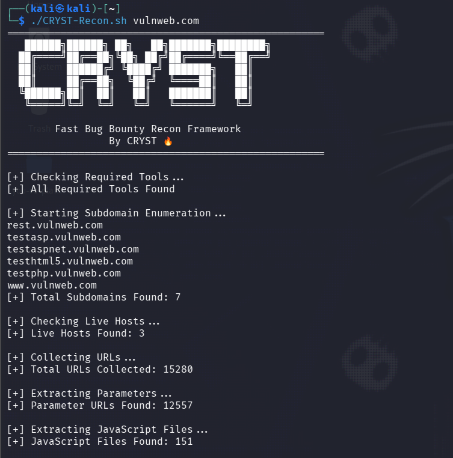
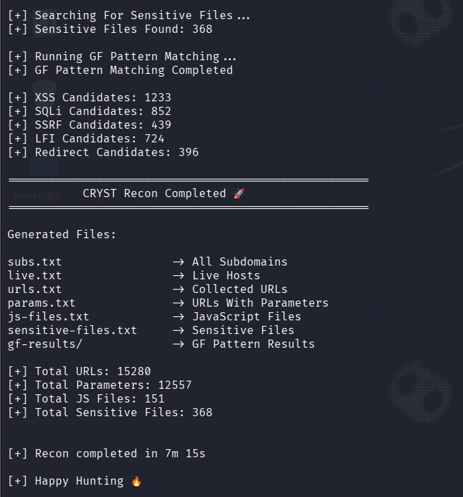

# CRYST Recon 🚀

Fast Bug Bounty Recon Framework built for quick reconnaissance and manual vulnerability hunting.

## Demo

### Recon Started



### Recon Completed



---

## Features

| Feature                  | Tool                           |
| ------------------------ | ------------------------------ |
| Subdomain Enumeration    | Subfinder, Assetfinder         |
| Live Host Detection      | Httpx                          |
| URL Collection           | Katana, Gau, Waybackurls       |
| Parameter Extraction     | Built-in                       |
| JavaScript Discovery     | Built-in                       |
| Sensitive File Discovery | Built-in                       |
| GF Pattern Matching      | XSS, SQLi, SSRF, LFI, Redirect |
| Runtime Statistics       | Built-in                       |

---

## Required Tools

Make sure the following tools are installed and available in your PATH:

* subfinder
* assetfinder
* httpx
* katana
* gau
* waybackurls
* gf

### Install ProjectDiscovery Tools

```bash
go install -v github.com/projectdiscovery/subfinder/v2/cmd/subfinder@latest
go install -v github.com/projectdiscovery/httpx/cmd/httpx@latest
go install github.com/projectdiscovery/katana/cmd/katana@latest
```

### Install Assetfinder

```bash
go install github.com/tomnomnom/assetfinder@latest
```

### Install Gau

```bash
go install github.com/lc/gau/v2/cmd/gau@latest
```

### Install Waybackurls

```bash
go install github.com/tomnomnom/waybackurls@latest
```

### Install GF

```bash
go install github.com/tomnomnom/gf@latest
```

---

## Usage

```bash
chmod +x CRYST-Recon.sh

./CRYST-Recon.sh example.com
```

---

## Output

The script generates:

```text
subs.txt
live.txt
urls.txt
params.txt
js-files.txt
sensitive-files.txt
gf-results/
```

---

## Workflow

```text
CRYST
  ↓
Subfinder
  ↓
Assetfinder
  ↓
Httpx
  ↓
Katana
  ↓
Gau
  ↓
Waybackurls
  ↓
Parameter Extraction
  ↓
JavaScript Discovery
  ↓
Sensitive File Discovery
  ↓
GF Pattern Matching
  ↓
Manual Testing
```

---

## Disclaimer

This tool is intended for authorized security testing, bug bounty programs, and educational purposes only. Always obtain permission before testing any target.

---

## Author

**Tilaksingh Rana (CRYST)**

GitHub: https://github.com/IamTilak
